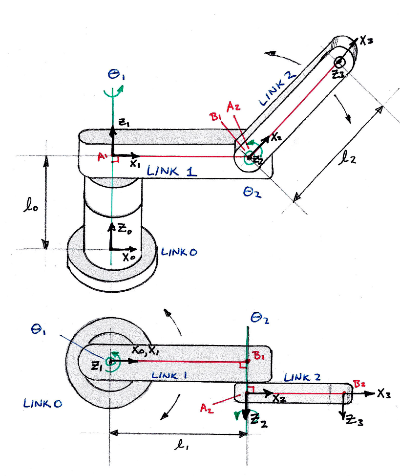

## Models of Robot Manipulation
an introductory graduate / advanced undergraduate course in 
robot manipulator kinematics, design, and control. 

### Blake Hannaford

[Give me the Book PDF!](Models_of_Robot_Manipulation.pdf)

<!--  -->

This project is a package of materials for teaching a course in robot manipulator kinematics and control. 
The Book evolved from course notes and contains influences from famous previous texts.  

Problems are provided for active learning.  In teaching the course, I spend about 1/2 the contact
hours on lecture, and the remainder supporting students while they work on the in-class-problems (``ICPs").   Then traditional 
homework problems and exams, done by each student individually,solidify the knowledge gained. 

Computing options include Scilab scripts (from older offerings) and Python tools.
The latest Python tools, which perform 
forward and inverse kinematics computations for serial arms, are 
available in the IKBT package 
[ on Github ](https://github.com/uw-biorobotics/IKBT)
and documented in [ arXiv:1711.05412](https://arxiv.org/abs/1711.05412). It is recommended to 
use the up-to date Github tools instead of the provided scripts. 

Please use branch ``typos'' to fix typos. 

## License

The entire contents of this repository ("Book", "Problems", "Software") 
is licensed under a 
[Creative Commons Attribution-ShareAlike 4.0 International License](http://creativecommons.org/licenses/by-sa/4.0/).

